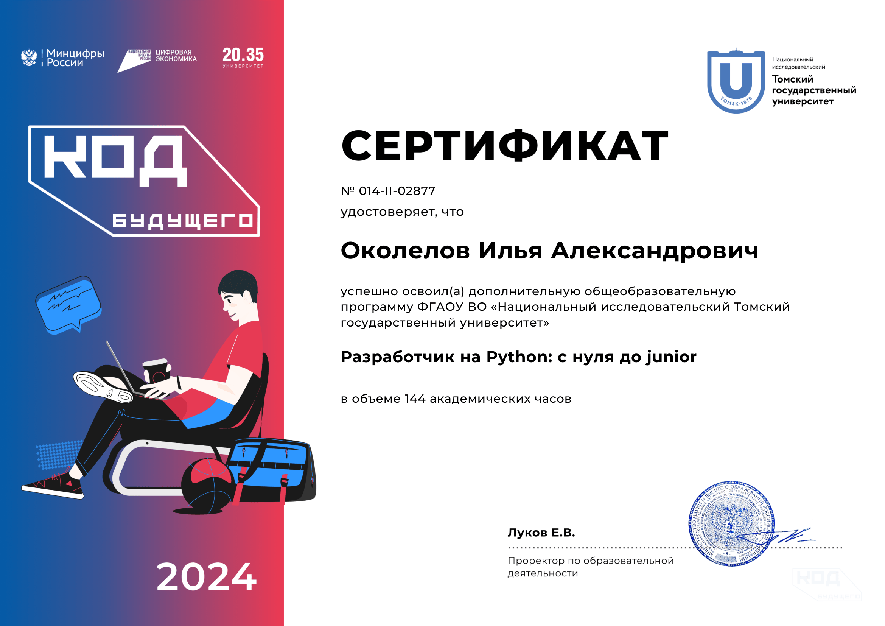

# Привет, я Илья 👋

📍 Живу в Норильске, Красноярский край  
📅 Активен в разработке с 2020 года  
🔭 В настоящее время изучаю: Python, машинное обучение и веб‑разработку  
🌱 Учусь писать чистый и эффективный код  
💬 Готов к обсуждению проектов, коллаборациям и стажировкам  

📫 **Связаться со мной:**  
- Email: [ilaokolelov726@gmail.com](mailto:ilaokolelov726@gmail.com)  
- VK: [djodah_avi](https://vk.com/djodah_avi)  
- GitHub: [IlyaCvazar](https://github.com/IlyaCvazar)

  
---

# 🛠️ Технологии и инструменты

### Языки программирования

### Инструменты и платформы

  
---

# 🏆 Достижения

## Участник государственной программы «Код будущего» — 2024

1. **Модуль 1.** Введение в структурное программирование на Python  
   - Типы данных, условия, циклы.
2. **Модуль 2.** Функциональное программирование  
   - Структуры данных.
3. **Модуль 3.** Объектно‑ориентированное программирование  
   - Решение задач.
4. **Модуль 4.** Прикладная разработка  
   - Графические игры, веб‑парсеры.

---

# 📊 Моя статистика

---

# 🐱 Мне нравится

- Кошки
- Открытый код
- Чёрный кофе
- Музыка в наушниках
- Тишина вокруг

Когда не пишу код - читаю документацию или смотрю лекции от МФТИ и Яндекса, либо деградирую в YouTube.
